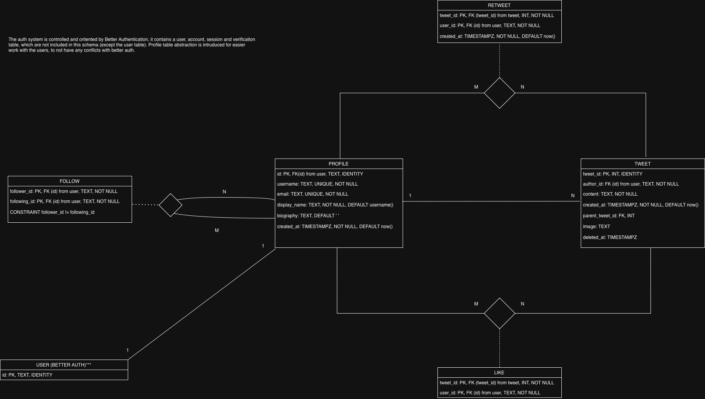

# Twitter Clone

A simple fully functional Twitter/X clone application built using modern web technologies.

## Overview and Architecture

The application mimics core Twitter/X functionalities, it follows a Client-Server architecture contained within a monorepo structure:

1. (`/client`): A Next.js application that handles the UI and Server-Side Rendering (SSR). It communicates with the backend via a reverse proxy setup.

2. (`/server`): A NestJS API. It is organized by feature modules (tweets, users, likes, follows..) for readability and scale. It uses Drizzle ORM for database abstraction and management.

3. Database: A PostgreSQL instance mainly running through a Docker container, connected via a private Docker network.

## Features
- User authentication and authorization
- Tweet creation and deletion with media support
- Feed System with infinite scrolling
- Like and retweet functionality
- User profiles viewing and editing with avatars
- Nested comment system
- Search functionality
- Follow/unfollow users
- Dark/Light mode support
- Responsive design for mobile and desktop
- Image Viewer with zoom and pan capabilities

## Tech Stack
- Frontend: NextJS, Shadcn, Tailwind CSS, Typescript
- Backend: NodeJS, NestJS, Drizzle ORM
- Database: PostgreSQL
- Authentication: BetterAuth
- Containerization: Docker & Docker Compose

### Video Demonstration: **A video demonstration of the application is located in the assets folder. Some things may look glitchy due to the result of video compression**

## Complete Database Schema


## Running the Application
### Option 1: Using Docker Compose (Recommended)
1. Clone the repository:
   ```bash
   git clone https://github.com/stefantrajanov/twitter-clone.git
   ```
   
2. Navigate to the project directory:
   ```bash
   cd twitter-clone
   ```
   
3. Start the application using Docker Compose:
   ```bash
   docker-compose up --build
   ```
   
4. Access the application at `http://localhost:3000`.

The database will be seeded automatically with random data on the first run, for easier testing purposes.

### Option 2: Manual Setup
#### Prerequisites
- Node.js (v20 or higher)
- PostgreSQL

#### Steps
1. Clone the repository:
   ```bash
   git clone https://github.com/stefantrajanov/twitter-clone.git
    ```
2. Navigate to the project directory:
    ```bash
    cd twitter-clone
    ```
3. Set up the PostgreSQL database:
   - Creating a new database and configure the connection settings in the env file in the server component.
   ```bash
   # .env
   DATABASE_URL=POSTGRES_CONNECTION_STRING
   ```
4. Install dependencies for both client and server:
   ```bash
   cd client
   npm install
   cd ../server
   npm install
   ```
5. Run database migrations:
   ```bash
   npx drizzle-kit migrate:latest
   ```
6. Start the server:
   ```bash
   npm run start:dev
   ```
7. Start the client:
   ```bash
   cd ../client
   npm run dev
   ```
8. Access the application at `http://localhost:3000`.